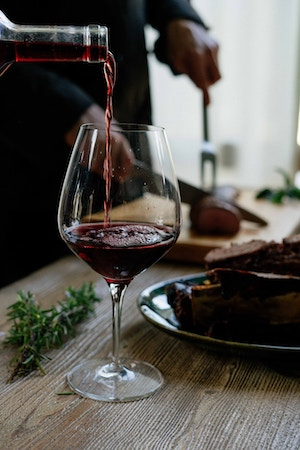
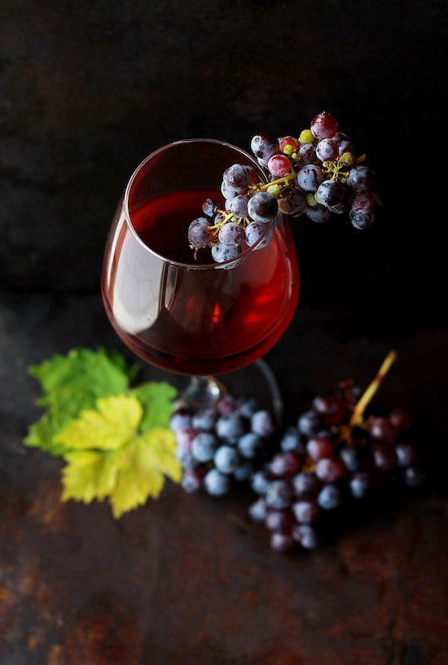

```{r setup, include=FALSE}
knitr::opts_chunk$set(echo = FALSE)
library(dplyr)
library(ggplot2)
library(plotly)
library(lubridate)
library(wesanderson)
pal <- wes_palette("Zissou1", 21, type = "continuous")
pal2 <- wes_palette("Zissou1", 7, type = "continuous")
fancy <- scale_fill_manual(values=pal)
fancy2 <- scale_fill_manual(values=pal2)
colfancy2 <- scale_color_manual(values=wes_palette("Zissou1", 4))

```

## App purpose

This app is meant to be used to find the best price/quality wines in the market. You can refine your search based on scores and prices, and inspect the data in a chart split by country, and a complete table.




## Step 2. Adjust the parameters

- Min points (scoring) will filter the results keeping only the scores greater that the specified param.
- Price scope will let you filter the results keeping only which price is between the indicated draggable indicator.

## Source

We first load wines from original source (VIVINO) and filter out some:
```{r cars, echo = TRUE, cache=TRUE, warning=FALSE, comment=""}
wine_ratings <- readr::read_csv("https://raw.githubusercontent.com/rfordatascience/tidytuesday/master/data/2019/2019-05-28/winemag-data-130k-v2.csv")
```

## Sample

```{r, echo=FALSE, warning=FALSE}

rank <- wine_ratings %>% 
    group_by(country, title) %>% 
    summarize(num_reviews=n(), avg_points=mean(points), avg_price=mean(price)) %>% 
    filter(avg_points>75 & avg_price<100 & num_reviews>=2) %>%
    arrange(country, avg_price, desc(num_reviews), desc(avg_points)) %>% 
    top_n(40) %>%
    mutate(reviews=as.factor(num_reviews))


g_rank <- rank %>%
    ggplot( aes(x=avg_points, y=avg_price, color=reviews, title=title, reviews=reviews)) +
    geom_point(alpha=0.7) +
    facet_wrap( vars(country)) + colfancy2 +
    xlab('Avg. score') + ylab('Avg. price') +
    theme( plot.margin = margin(1, 0, 0, 0, "cm"))

ggplotly(g_rank) %>%     
    layout(title = list(
        text = paste0('Top 40 wines with price < 100 u$s, by country','<br>','<sup>','Ignoring wines with less than 2 reviews. Original source: VIVINO app','</sup>')))


```

## Thanks you!

Thanks to all co-students that will review this work.


